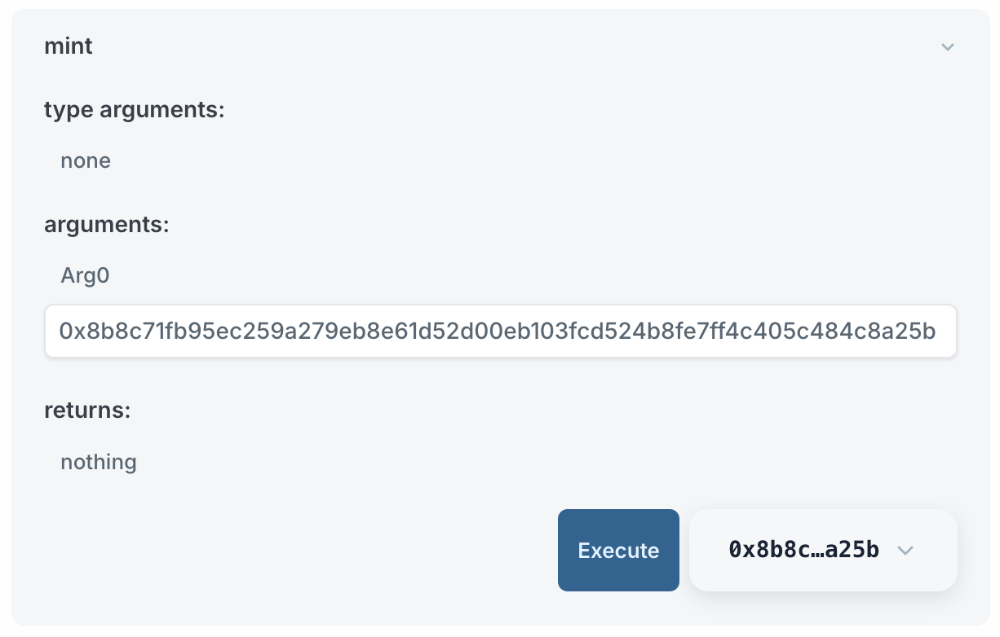
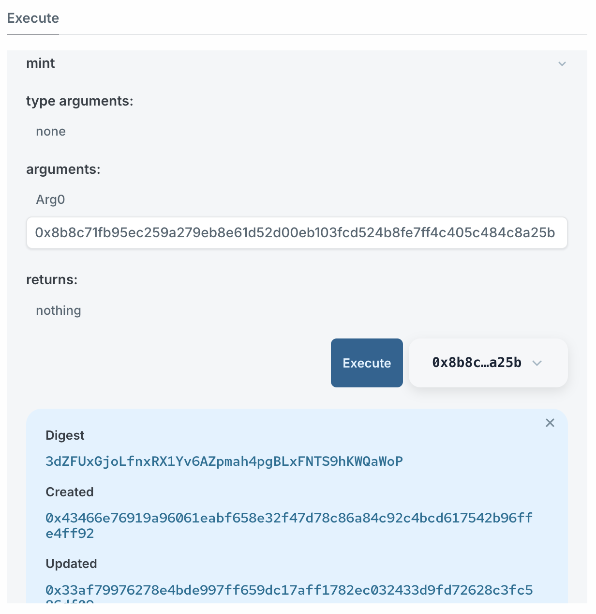

# Read Example Code

Open the [Counter project source code](../example_projects/counter/sources/counter.move), [compare](../images/explorer01.png) and read.


### Basic Layout

In the most basic code layout,

```move
module counter::counter {

}
```

The first `counter` is the `Package`, which after being published to the testnet, is assigned an on-chain address, resulting in `Package ID: 0xf97e49265ee7c5983ba9b10e23747b948f0b51161ebb81c5c4e76fd2aa31db0f`.

The second `counter` is the `Module`, the module name, which can be customized to other names.

Within the scope of this `module`, data structures and corresponding functions are defined. Sui Move programming is simple; define data structures and implement the functions they require.

## Defining Data Structures
```move
public struct Counter has key, store {
    id: UID,
    times: u64,
}
```
`Counter` is the data structure used for counting. In addition to the `times` attribute for storing count information, there is also `id`, which is a unique `UID` across the entire chain, used to represent the index of the resource. `key` and `store` are capabilities defined for this data structure, which we will not delve into here and will study together in the future.

Data structures with the `key` capability are also called `Object`, which can be directly stored and used on the chain, commonly used to represent assets. `store` supports the `Object` can be owned by other `Object`s, or in other words, become child data.

## Defining Functions

```move
public fun mint(recipient: address, ctx: &mut TxContext) {
    let counter = new(ctx);
    transfer::public_transfer(counter, recipient);
}

public fun count(counter: &mut Counter) {
    counter.times = counter.times + 1;
}

public fun burn(counter: Counter) {
    let Counter {
        id,
        ..
    } = counter;
    object::delete(id);
}

fun new(ctx: &mut TxContext): Counter {
    Counter {
        id: object::new(ctx),
        times: 0,
    }
}
```

### Public and Private Functions

There are 4 functions defined, but only 3 can be seen on the [explorer](https://explorer.polymedia.app/object/0xf97e49265ee7c5983ba9b10e23747b948f0b51161ebb81c5c4e76fd2aa31db0f?network=testnet).
`mint`, `burn`, `count`, these three functions are public functions, declared using the `public fun fun_name(arg: datatype) { ... }` structure, where `public` is the keyword for public functions, so these three functions can be directly called externally. `mint` means minting, which is `create`, and `burn` means destroying, which is `destroy`. Many smart contract developments use these two terms to express, just because of the linguistic evolution of the Ethereum era.

The declaration of the `new` function does not have `public`, so it defaults to a private function, which can only be called by functions within this Package, so it is also invisible on the explorer.

If the project development volume is large, there will be many modules under the same Package. At this time, you can use `public(package) fun fun_name` to define functions, which can be called by other modules within the same Package.

### Isolation Principle and Read/Write Functions

The `count` function is a write function, and a read function is usually also defined
```move
public fun count(counter: &mut Counter) {
    counter.times = counter.times + 1;
}

public fun times(counter: &Counter): u64 {
    counter.times
}
```
We can see that within the module that defines the `Counter` data structure, you can directly read and write its data, but outside the module, you can only operate the data through the public functions defined in the module, and cannot define the read and write methods of the data in other modules. This is also known as the isolation principle.

### References and Data Ownership

In the above simple functions, it can be seen that when the `Counter` object data structure is passed as a function argument, there are three different formats.
- Passing the value of `Counter`
- `&Counter` immutable reference
- `&mut Counter` mutable reference

The `Counter` format indicates the transfer of the value, which means the original ownership must be transferred, such as transferring to another account address; or the resource is consumed, such as deleting the resource with delete or reclaiming the resource with drop.
If you do not want to pass the value, you can input the reference of the value. Use an immutable reference in read functions; use a mutable reference in write functions.

### Experiment
Now let's do an experiment, in the [contract explorer](https://explorer.polymedia.app/object/0xf97e49265ee7c5983ba9b10e23747b948f0b51161ebb81c5c4e76fd2aa31db0f?network=testnet), connect the wallet and call the `mint` function twice.


Enter your current account address for the first time, and 0x0 for the second time.

Both executions will generate a `Counter` Object.


Place the `Counter` Object IDs generated in the two executions into the `count` function and the `burn` function, respectively, to see what effects will occur?
